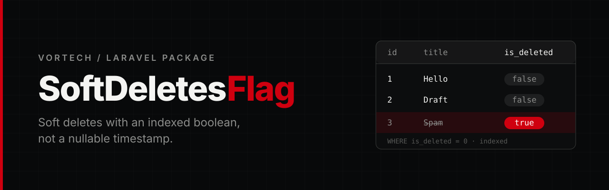

<p align="center">
  
</p>

<p align="center">
  <a href="https://github.com/Vortech-Group/softdeletes-flag/actions/workflows/tests.yml"></a>
  <a href="https://packagist.org/packages/vortech/softdeletes-flag"></a>
  <a href="https://packagist.org/packages/vortech/softdeletes-flag"></a>
  <a href="https://packagist.org/packages/vortech/softdeletes-flag"></a>
  
  <a href="LICENSE.md"></a>
</p>

<p align="center">
  Drop-in soft deletes for Laravel Eloquent that use an <strong>indexed boolean flag</strong><br>
  instead of a nullable timestamp, for faster queries in high-load applications.
</p>

---

## Why

Laravel's built-in `SoftDeletes` filters every query with `WHERE deleted_at IS NULL`. `SoftDeletesFlag` swaps that for a plain, indexed boolean:

| | `SoftDeletes` | `SoftDeletesFlag` |
|---|---|---|
| Column | `deleted_at` `TIMESTAMP NULL` | `is_deleted` `BOOLEAN DEFAULT 0` |
| Live rows filter | `deleted_at IS NULL` | `is_deleted = 0` |
| Index | on a high-cardinality timestamp | on a two-value flag |
| Knows *when* it was deleted | yes | no |

If you need the deletion time, keep using `SoftDeletes`. If you only need to know *whether* a row is deleted, this package gives you the same API with a cheaper filter.

## Requirements

- PHP 8.3+
- Laravel 13

## Installation

```bash
composer require vortech/softdeletes-flag
```

The service provider is registered automatically through package discovery. Then run the install command to publish the config file:

```bash
php artisan softdeletes-flag:install
```

Use `--force` to overwrite an existing config file.

## Usage

### 1. Add the column

```php
Schema::create('posts', function (Blueprint $table) {
    $table->id();
    $table->string('title');
    $table->softDeletesFlag();
    $table->timestamps();
});
```

`softDeletesFlag()` adds an indexed `boolean` column that defaults to `false`. To remove it in `down()`:

```php
$table->dropSoftDeletesFlag();
```

This drops the index together with the column.

### 2. Add the trait

```php
use Illuminate\Database\Eloquent\Model;
use Vortech\SoftDeletesFlag\Traits\SoftDeletesFlag;

class Post extends Model
{
    use SoftDeletesFlag;
}
```

That is all. If you know Laravel's `SoftDeletes`, you already know this.

## API

```php
$post->delete();        // sets is_deleted = true
$post->trashed();       // true
$post->restore();       // sets is_deleted = false
$post->forceDelete();   // really deletes the row

Post::all();                    // live rows only
Post::withTrashed()->get();     // live + trashed
Post::onlyTrashed()->get();     // trashed only
Post::withoutTrashed()->get();  // live only, explicitly

Post::onlyTrashed()->restore();            // bulk restore
Post::where('author_id', 1)->delete();     // bulk soft delete
Post::where('author_id', 1)->forceDelete(); // bulk hard delete

Post::restoreOrCreate(['title' => 'Hello']);  // restore a trashed match, or create
Post::createOrRestore(['title' => 'Hello']);  // create, or restore on a unique conflict
```

### Events

`trashed`, `restoring`, `restored`, `forceDeleting` and `forceDeleted` are fired, just like with `SoftDeletes`. Returning `false` from `restoring` or `forceDeleting` cancels the operation.

```php
Post::softDeleted(fn (Post $post) => Log::info("Trashed {$post->id}"));
Post::restored(fn (Post $post) => Log::info("Restored {$post->id}"));
```

Quiet variants are available too: `restoreQuietly()` and `forceDeleteQuietly()`.

### Route model binding

Implicit route model binding skips trashed models and returns a `404`. Opt in per route with `withTrashed()`:

```php
Route::get('/posts/{post}', ShowPost::class);                      // trashed → 404

Route::get('/admin/posts/{post}', ShowPost::class)->withTrashed(); // trashed → resolved
```

Scoped bindings, custom binding fields (`{post:slug}`) and backed enums work as usual.

## Configuration

The column defaults to `is_deleted`. To change it, edit the config file published by `softdeletes-flag:install` (or publish it manually with `php artisan vendor:publish --tag=softdeletes-config`):

```php
// config/softdeletes-flag.php
return [
    'column_name' => 'is_deleted',
];
```

Set the name before running your migrations. Changing it later means renaming the column yourself.

## Good to know

- **Unique indexes.** A trashed row still occupies its unique value. Use `restoreOrCreate()` / `createOrRestore()` to bring the old row back instead of inserting a duplicate.
- **No deletion timestamp.** Only `updated_at` changes on delete. Log deletions yourself if you need an audit trail.

## Testing

```bash
composer test
```

The suite uses [Pest](https://pestphp.com) and requires PHP 8.4+ to run.

## Changelog

See [CHANGELOG](CHANGELOG.md) for what has changed recently.

## Security

If you discover a security issue, please email [mate@vortech.hu](mailto:mate@vortech.hu) instead of using the issue tracker.

## Credits

- Mate Papp, Developer @ Vortech

## License

The MIT License (MIT). See the [License File](LICENSE.md) for more information.

---

<p align="center">
  <a href="https://vortech.hu">
    <picture>
      <source media="(prefers-color-scheme: dark)" srcset="art/logo-white.png">
      
    </picture>
  </a>
</p>
